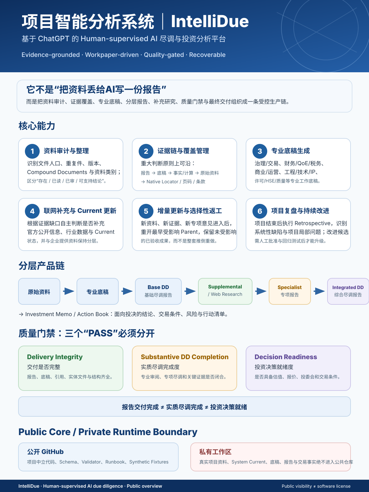

# IntelliDue

**Human-supervised AI for due diligence and investment analysis**  
**基于 ChatGPT 的 Human-supervised AI 项目尽调与投资分析系统**

> IntelliDue is not a “drop files into AI and get a summary” project. It is an attempt to turn a real due-diligence workflow into a controlled AI production system: source-room audit, evidence coverage, professional workpapers, layered reports, supplemental/current research, quality gates, recovery, and post-project improvement.

<p align="center">
  
</p>

## What IntelliDue does

A typical workflow is:

**Raw project sources → evidence control → professional workpapers → Base DD → Supplemental / Web Research → Specialist workstreams → Integrated DD → Investment Memo / Action Book**

The private operating system is designed to help an investment team:

- audit and reconcile heterogeneous project rooms instead of treating “file exists” as “file reviewed”;
- separate source-bound facts, management representations, calculations, professional judgments, contradictions and missing evidence;
- build structured workpapers across corporate/transaction, finance/QoE/tax, commercial/operations, engineering/technology/IP and permit/HSE/quality domains;
- decide when public/current information or specialist work is needed and keep it separate from historical company-provided evidence;
- update the earliest affected analytical parent when new evidence arrives instead of rebuilding the whole project;
- produce decision-readable reports while keeping major conclusions traceable back to controlled evidence;
- fail closed when evidence is insufficient rather than manufacturing valuation, IRR or “decision ready” conclusions;
- recover interrupted projects, selectively repair affected products and preserve accepted work;
- run a project-closeout retrospective and generate system-improvement candidates without allowing the AI to silently rewrite System Current.

## Three different gates — deliberately not one `PASS`

IntelliDue separates:

| Gate | Question |
|---|---|
| **Delivery Integrity** | Are the required reports, workpapers, references, entity files and delivery structure complete? |
| **Substantive DD Completion** | Have the necessary professional review, specialist workstreams and critical evidence actually closed? |
| **Decision Readiness** | Is the project ready for valuation, pricing, investment committee and transaction decisions? |

**Package complete ≠ Full DD complete ≠ Decision ready.**

This distinction is intentional. A project with incomplete current financials, unverified customers, unresolved permits or unfinished specialist review may still have a high-quality red-flag / desktop DD product, but it must not be promoted as a completed investment-decision package.

## Public Core vs. private operating system

This repository is intentionally **not the whole IntelliDue operating package**.

| Public `intellidue-core` | Private workspace / System Current |
|---|---|
| project-neutral code and contracts | real project sources |
| schemas and validators | private System Current package |
| release / recovery controls | professional workpapers |
| synthetic fixtures and regression tests | Base / Supplemental / Specialist / Integrated reports |
| public-safe runbooks and acceptance evidence | transaction facts, prices, client data and decision outputs |

The public Core exists so the control layer is inspectable, versioned and regression-tested without putting real diligence data into GitHub.

**Real project data, reports, private filenames, source hashes, cloud links and transaction facts must never enter this public repository.** See [`SECURITY.md`](SECURITY.md), [`docs/private-data-assurance.md`](docs/private-data-assurance.md) and [`docs/public-private-boundary.md`](docs/public-private-boundary.md).

## Why this repository contains many contracts and validators

The most difficult failure mode in AI due diligence is not “the model cannot write”. It is that a system can produce a polished document while silently skipping review, mixing evidence dates, dropping an affected parent, treating an issue memo as completed specialist diligence, or calling a delivery package `PASS` when substantive work is still open.

The public Core therefore focuses on controls that are useful precisely when the analysis engine is powerful:

- source-review coverage contracts;
- product lifecycle and parentage;
- role-to-pack placement rules;
- deterministic manifests and SHA-256 reconciliation;
- Current / Archive / Last-success state;
- atomic promotion, rollback and crash recovery;
- private-runtime binding and cross-project contamination rejection;
- Reader / Control separation;
- RP-Final package integrity;
- negative fixtures that must fail when a memo-only or incomplete delivery is presented as a complete product.

The professional analysis and writing engine remains ChatGPT in an authorized private project workspace.

## Current maturity

The system has been iteratively developed and tested against **two real private project workflows** without publishing their project data to this repository.

Current operating position:

- public Core: operational and versioned;
- source-to-report control chain: implemented;
- private runtime, recovery and selective repair: implemented;
- professional delivery / RP-Final integrity controls: implemented;
- substantive DD completion and decision-readiness separation: implemented in the private System Current;
- operating model: **Human-supervised AI** — AI performs most evidence processing, analysis and product production; professional users retain scope, major-judgment and final-acceptance responsibility.

The goal is not to replace lawyers, accountants, engineers or investment professionals. The goal is to move a large part of document handling, cross-file reconciliation, workpaper production, report integration and QC into a repeatable AI workflow so specialists can spend more time on judgment and decisions.

## Architecture at a glance

The public control layer currently covers:

- source and evidence controls;
- product-stack and quality-gate contracts;
- deterministic manifests and filesystem reconciliation;
- strict release-package construction and validation;
- Current, Archive and Last-success pointers;
- atomic promotion, rollback and crash recovery;
- Reader / Control separation;
- clean-room state recovery;
- public/private data boundaries;
- CI, security scanning and reproducible release controls;
- offline private-project runtime adapter with project binding and controlled promotion;
- professional delivery and RP-Final topology validation.

Detailed documents:

- [`docs/architecture.md`](docs/architecture.md)
- [`docs/operating-model.md`](docs/operating-model.md)
- [`docs/new-project-runbook.md`](docs/new-project-runbook.md)
- [`docs/professional-delivery-controls.md`](docs/professional-delivery-controls.md)
- [`docs/private-data-assurance.md`](docs/private-data-assurance.md)
- [`docs/quality-gates.md`](docs/quality-gates.md)

## Public-core quick check

```bash
python -m unittest discover -s tests -v
intellidue version
intellidue validate-state tests/fixtures/synthetic_project/current_project_state.json
intellidue validate-validation tests/fixtures/synthetic_project/package_validation.json
intellidue validate-contract \
  --state tests/fixtures/synthetic_project/current_project_state.json \
  --lock tests/fixtures/synthetic_project/release_lock.json \
  --validation tests/fixtures/synthetic_project/package_validation.json
intellidue validate-package tests/fixtures/synthetic_project/package.zip
```

## Private project runtime

The public Core can operate against a private project directory without copying project data into the public repository.

```bash
intellidue validate-private-project --project-root /private/project
intellidue inspect-private-project --project-root /private/project
intellidue build-private-release --project-root /private/project --output /private/releases/project-v1.zip
intellidue promote-private-release --project-root /private/project --runtime /private/runtime
intellidue validate-private-runtime --runtime /private/runtime
```

The adapter packages already-controlled private products. It does **not** itself perform professional diligence analysis or generate Reader content.

## Security and privacy boundary

This repository is public by design, but the private-data boundary is strict:

- `.gitignore` blocks common private office-document and project directories;
- repository hygiene checks reject prohibited binaries and configured private identifiers;
- generic CI uses synthetic fixtures only;
- secret scanning, dependency review and CodeQL are part of repository governance;
- the private runtime performs no network writes and rejects cross-project contamination;
- real project facts remain in the authorized private workspace.

No architecture can make operator or account risk literally zero. IntelliDue should be treated as a layered control system, not an unconditional confidentiality guarantee.

## Release / status

Public Core historical release baseline:

- Production product standard: `v1.0.0`
- Public-core private-runtime-adapter version: `v1.5.0`
- Schema contract: `v1.0.0`
- CLI contract: `v1.0.0`
- Immutable release tag: `core-v1.5.0`

The public repository has since received additional project-neutral professional-delivery controls on `main`.

## Collaboration and feedback

I am interested in feedback from people working in investment, M&A, due diligence, professional services, AI workflow engineering and enterprise knowledge systems — especially on:

- where Human-supervised AI can realistically replace repetitive diligence work;
- evidence traceability and professional-review controls;
- workpaper-to-report production;
- enterprise data / permission integration;
- failure modes when AI systems operate across long, multi-stage projects.

Issues and pull requests are welcome **only with synthetic / project-neutral content**. Do not post client, transaction or confidential project information.

## License / reuse boundary

This public repository deliberately has **no software license**. Public visibility does not grant permission to copy, modify, distribute, sublicense, publish, sell or commercially reuse the code or documentation. See [`NO_LICENSE.md`](NO_LICENSE.md).

The private operational package and real project products are not distributed through this repository.
